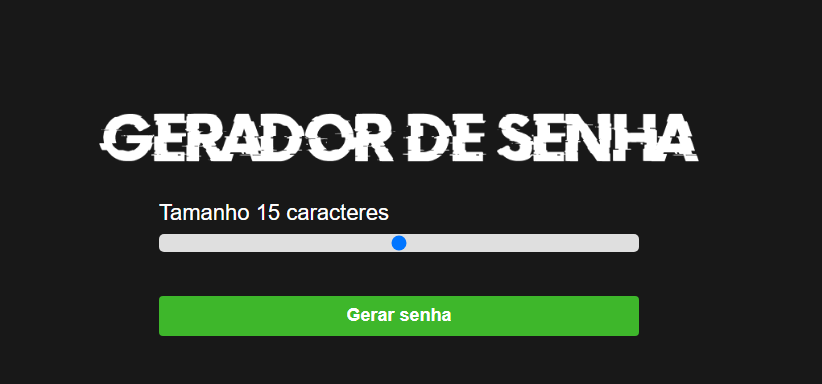

# Gerador de Senha

Um simples gerador de senha criado usando HTML, CSS e JavaScript.



## Como Usar

1. Faça o download ou clone o repositório:

```bash
git clone https://github.com/jeffviana/gerador.git

Abra o arquivo index.html no seu navegador.

Utilize o gerador de senha para criar senhas seguras.

Recursos
Gera senhas aleatórias e seguras.
Personalize o comprimento da senha.
Interface simples e fácil de usar.

Sinta-se à vontade para contribuir ou sugerir melhorias para este projeto. Abra uma issue ou envie um pull request.

Este projeto é licenciado sob a Licença MIT - veja o arquivo LICENSE.md para mais detalhes.

Agradecemos por usar o nosso gerador de senha!
